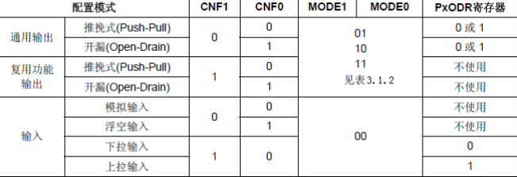
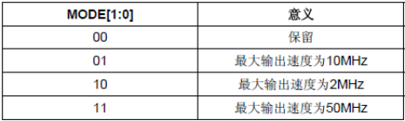

# GPIO 的 八种模式

首先要提一下，在固件库中，GPIO端口操作对应的库函数函数以及相关定义在文件**stm32f10x_gpio.h**和**stm32f10x_gpio.c**中。

STM32的IO口相比51而言要复杂得多，所以使用起来也困难很多。首先STM32的IO口可以由软件配置成如下*8种模式*：
### IO口位配置表

    1. 输入浮空
    2、输入上拉
    3、输入下拉
    4、模拟输入
    5、开漏输出
    6、推挽输出
    7、推挽式复用功能
    8、开漏复用功能

1. 输入浮空：什么都不接时，电平由内部结构决定，输**入什么便是什么**，*不稳定*不建议使用
2. 输入上拉：连接电阻到VCC，相当于默认**高电平**
3. 输入下拉：连接电阻到GND，相当于默认**低电平**
4. 模拟输出：通过ADC将自然信号转化为**数字电路**——*有连贯效果*
5. 开漏输出：高电平*没有驱动能力*，需要借助***外部上拉电阻***才能真正输出高电平
6. 推挽输出：能输出高低电平、且高低电平都有**驱动能力**，*不能实现线与的功能*
7. 推挽式复用功能：GPIO口被用作第二功能时的配置情况
8. 开漏复用功能：GPIO口被用作第二功能时的配置情况

### 输出模式配置表

# GPIO库函数
### 初始化函數
    void GPIO_Init(GPIO_TypeDef* GPIOx, GPIO_InitTypeDef* GPIO_InitStruct)
**第一个参数是用来指定 GPIO，取值范围为 GPIOA~GPIOG。
第二个参数为初始化参数结构体指针，结构体类型为 GPIO_InitTypeDef。**