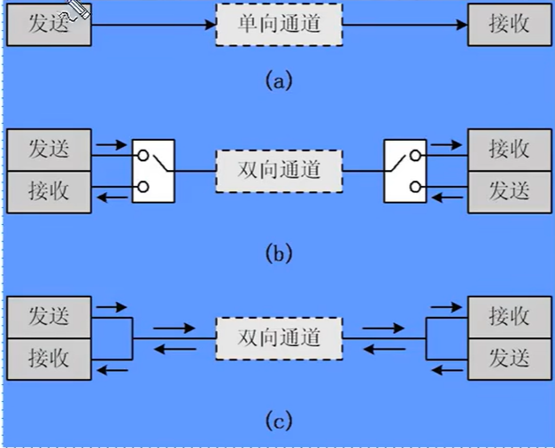

# 串行通信接口背景知识

## 处理器与外部设备通信的两种方式

* 并行通信

    * 传输原理:数据各个位同时传输.
    * 优点:速度快
    * 缺点:占用引脚资源多

* 串行通信
    * 传输原理:数据按位顺序传输
    * 优点:占用引脚资源少
    * 缺点:速度相对较慢

---

## 串行通信:

**按照数据传送方向,分为:**
* 单工:

    数据传输只支持数据在一个方向上传输

* 半双工:

    允许数据在两个方向上传输,但是,在某一时刻,只允许数据在一个方向上传输,它实际上是一种切换方向的单工通信;

* 全双工:

    允许数据同时在两个方向上传输,因此,全双工通信时两个单工通信方式的结合,它要求发送设备和接受设备都有独立的接受和发送能力

---

# STM32F1串口框图讲解

---

# STM32串口常用寄存器和库函数

---

# 串口哦配置方法

---

# 串口通信实验讲解

---

> <STM32F1开发指南-库函数版本>
> >5.3usart串口文件夹介绍
> >第九章 串口实验