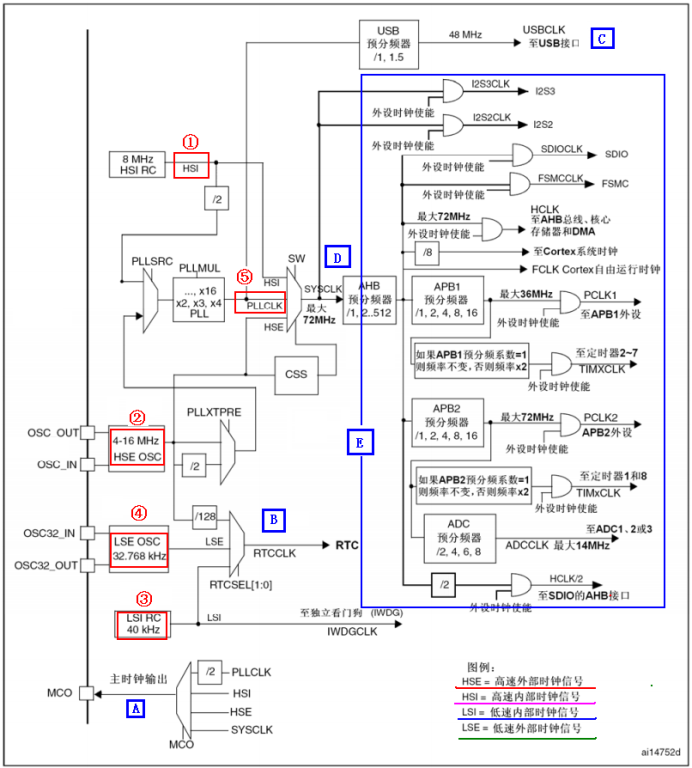

# stm32系统时钟系统
---
## STM32 时钟系统图

---

### HSI内部时钟

**内置RC震振荡器** *可被关闭*

精度不高，*可用于系统时钟*

**一般为8MHz**

---
### HSE高速外部时钟

一般是外接高速晶振作为时钟源

---
### LSE外部低速时钟

一般是外接低速晶振作为时钟源

---
### LSI内部低速时钟

**内部低速时钟**，*可用于独立看门狗时钟*

---
### CSS

时钟监视系统，**一旦HSE失效则自动切换至SYSCLK=HSI**

---
## AHB预分频

分频因子共有九种选择，*分别为1、2、4、6、16、64、128、256、512*

---
## 时钟系统总结

1. STM32有五个时钟源：**HSI、HSE、LSI、LSE、PLL**
   1. HSI是高速内部时钟，RC振荡器，频率为8MHz，精度不高。
   2. HSE是高速外部时钟，可接石英/陶瓷谐振器，或者接外部时钟源，频率范围为4MHz~16MHz。
   3. LSI是低速内部时钟，RC振荡器，频率为40KHz，提供低功耗时钟。WDG
   4. LSE是低速外部时钟，接频率为32.768KHz的石英晶体。RTC
   5. PLL为锁相还倍频输出，其时钟源课选择为HSI/2、HSE或者HSE/2。倍频可选择为2~16倍，但是其输出频率最大不得超过72MHz。
2. 系统时钟SYSCLK 可来源于三个时钟源：
   1. HSI振荡器时钟
   2. HSE振荡器时钟
   3. PLL时钟
3. STM32可以选择一个时钟信号输出到MCO脚（PA8）上，可以选择为PLL输出的2分频、HSI、HSE、或者系统时钟。
4. **任何一个外设在使用之前，必须首先使能其对应的时钟。**

---
